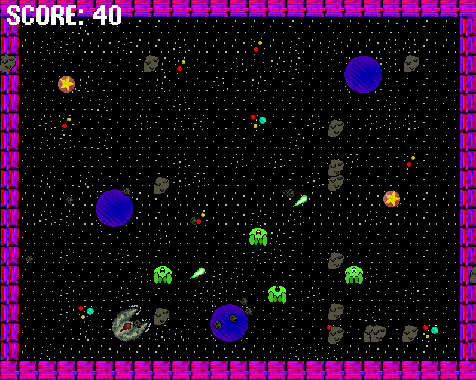
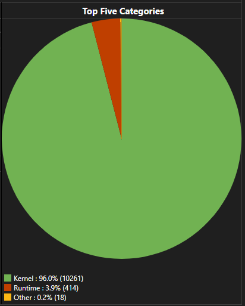
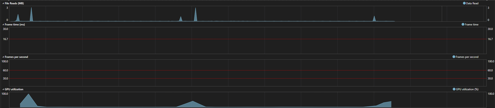
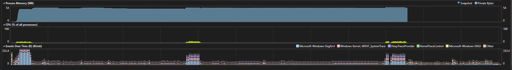

#  Spaceship Shooters

Spaceship shooters is a game built in SDL using C++, take pilot in a spaceship and destroy asteroids, but there are aliens attacking!
How long can you survive be the alien assault?

## Features
* Control your ship and fly through space!
* Shoot your laser cannons and collect upgrades!
* Destroy asteroids to gain score!
* Hide on planets to avoid the aliens!
* Avoid invincible aliens that chase you!

## Controls
* ​WASD - Movement & Rotation
* Space - Shoot
* Mouse - Select Menu Options

## Dependencies
* SDL library
* SDL Image
* SDL mixer
* SDL ttf

## Target platforms
Support Windows x86/x64.

Instructions to build on Windows platforms:
1) Load .sln solution with Visual Studio;
2) Select Release configuration, and x64 Architecture;
3) Compile and run the project.

## Code Profiling & Optimisations
The game is handled using a state machine, each section below breaks down memory usage of each game state. Each profile is done 5 times then an average is taken.

### Main Menu
The game uses an average of 43mbs of memory in this state.

First run of the menu takes 8ms.

Updating the menu takes 2.6ms.

Drawing the menu takes 4.6ms.

### Game
The game uses an average of 48mbs of memory in this state, although this is an average it does fluctuate depending on what is happening.

First run of the game takes 21ms.

Updating the game takes 19.2ms, this is with a forced SDL_Delay to keep the game running around 60fps.

Drawing the game takes 20.2ms.

### End Menu
The game uses an average of 47mbs of memory in this state.

First run of the end menu takes 5ms.

Updating the end menu takes 2.8ms.

Drawing the end menu takes 2.6ms.

### CPU Usage In Game

The spikes in usage in the above images happen when the menus are open, I'm not sure why this is, it may have something to do with me not limiting the frame rate but I'm not entirely sure. No known issues are caused from this though.

### Optimisation Technique Examples
* Bullets utilise object pooling.
* Optimisation settings have been enabled in the project such as "Fiber-Safe Optimisations", to handle memory management.
* Astar algorithm uses a validity check to see it can move there before doing so.

## Resources & References
* Libsdl.org. (2024). SDL2_image/IMG_Load. [online] Available at: https://wiki.libsdl.org/SDL2_image/IMG_Load [Accessed 3 Oct. 2024]. - Used for figuring out SDL_Image extension for SDL2
* Let's Make Games (2017). Making A Game #1: Making The Game Loop : C++ And SDL2 Tutorial. [online] YouTube. Available at: https://youtu.be/44tO977slsU?si=bdUZJCb76TM5EuAE [Accessed 3 Oct. 2024]. - Using for learning headers & inspiration for building my own
* Cppreference.com. (2023). std::cos, std::cosf, std::cosl - cppreference.com. [online] Available at: https://en.cppreference.com/w/cpp/numeric/math/cos [Accessed 8 Oct. 2024]. - Used for figuring out player rotation and movement
* Cppreference.com. (2023). std::sin, std::sinf, std::sinl - cppreference.com. [online] Available at: https://en.cppreference.com/w/cpp/numeric/math/sin [Accessed 8 Oct. 2024]. - Used for figuring out player rotation and movement
* www.youtube.com. (n.d.). [Ep. 49] Creating a Tile Map in SDL | Introduction to SDL2. [online] Available at: https://www.youtube.com/watch?v=DNu8yUsxOnE [Accessed 9 Oct. 2024]. - Used for building tilemap
* Coding with Murat (2023). Dynamic Array in C++ Using Heap Memory. [online] YouTube. Available at: https://www.youtube.com/watch?v=zVP98f6_WI4 [Accessed 9 Oct. 2024]. - Used to help with memory allocation after stack overflow in main from a massive array
* www.tutorialspoint.com. (n.d.). C++ Dynamic Memory - Tutorialspoint. [online] Available at: https://www.tutorialspoint.com/cplusplus/cpp_dynamic_memory.htm [Accessed 9 Oct. 2024]. - Used to help with memory allocation after stack overflow in main from a massive array
* www.bogotobogo.com. (n.d.). C++ Tutorial: Random Numbers - 2020. [online] Available at: https://www.bogotobogo.com/cplusplus/RandomNumbers.php [Accessed 9 Jan. 2024]. - Used to help with spawning asteroids
* www.opengameart.org (n.d.). 32 x 32 Spaceships - BizmasterStudios [online] Available at: https://opengameart.org/content/32-x-32-spaceships [Accessed 9 Jan. 2024]. - Used for player sprite
* Freesound.org. (2016). Freesound - laser one-shot #1.wav by djfroyd. [online] Available at: https://freesound.org/people/djfroyd/sounds/348164/ [Accessed 10 Jan. 2025]. - Laser Sound
* lazyfoo.net. (n.d.). Lazy Foo’ Productions. [online] Available at: https://lazyfoo.net/SDL_tutorials/lesson11/index.php [Accessed 11 Jan. 2024] - Sound Guide
* Lazyfoo.net. (2024). Lazy Foo’ Productions - Mouse Events. [online] Available at: https://lazyfoo.net/tutorials/SDL/17_mouse_events/index.php [Accessed 11 Jan. 2025]. - Used for buttons
* w3resource. (2024). C++ File handling: Decrypt text file contents. [online] Available at: https://www.w3resource.com/cpp-exercises/file-handling/cpp-file-handling-exercise-13.php [Accessed 11 Jan. 2025]. - Encryption
* GeeksforGeeks. (2016). XOR Cipher - GeeksforGeeks. [online] Available at: https://www.geeksforgeeks.org/xor-cipher/ [Accessed 11 Jan. 2025]. - Cypher type

## Contact
Will - William.Harper@mail.bcu.ac.uk
Student Number - 23153681
